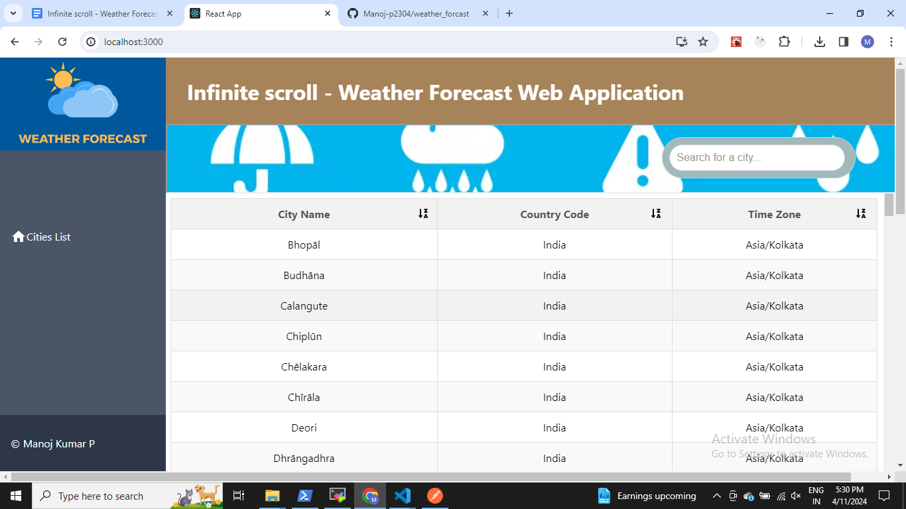
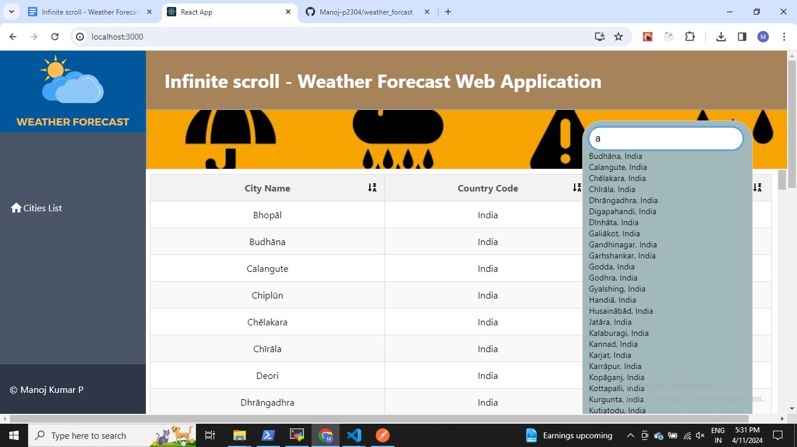
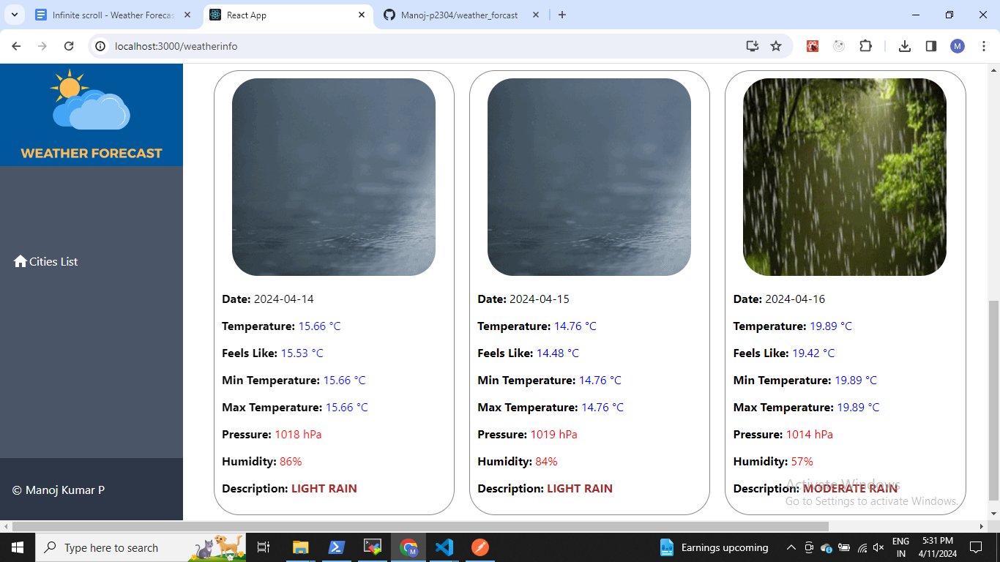
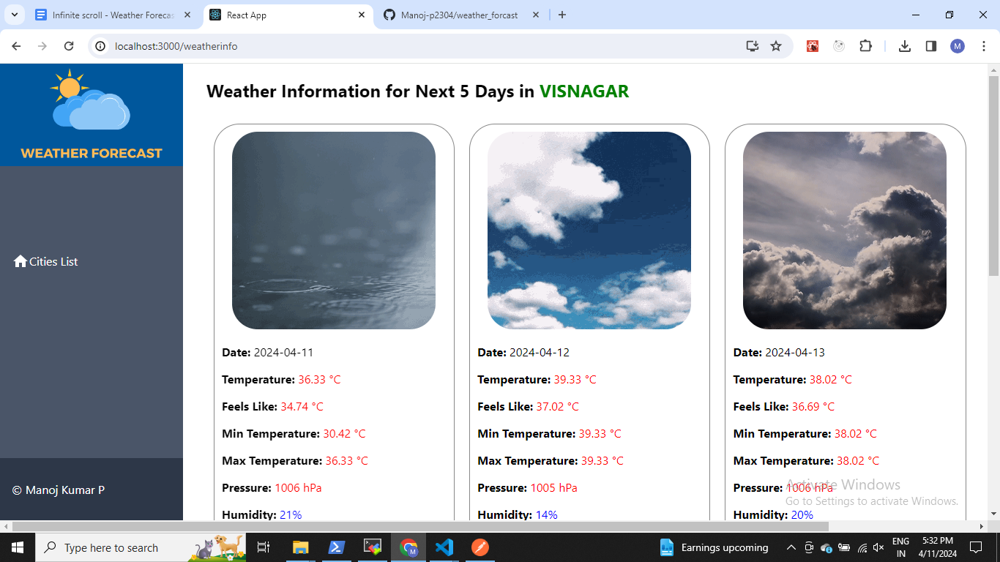

# Infinite Scroll Weather Forecast Web Application

Welcome to our Infinite Scroll Weather Forecast Web Application! This project provides a seamless experience for exploring weather information for cities around the world. With its intuitive interface and powerful features, you can easily discover weather forecasts for any city you're interested in.

## Features

- **Infinite Scroll:** Scroll through an extensive list of cities effortlessly with our infinite scroll feature.
- **Search Functionality:** Quickly find cities using the search bar, which filters results in real-time as you type.
- **Sortable Table:** Sort the city list alphabetically by city name, country code, or time zone with a single click.
- **Responsive Design:** Enjoy a smooth user experience across devices of all sizes, from desktop to mobile.
- **Interactive Autocomplete:** Get suggestions as you type in the search bar, making it easier to find the city you're looking for.
- **Weather Information:** Access detailed weather information for any city, including current conditions, forecasts, and more.

## Technologies Used

- **React:** Built with React.js for a fast, interactive, and modern user interface.
- **React Router:** Utilized React Router for seamless navigation and URL handling.
- **Axios:** Used Axios for making HTTP requests to fetch city data from the API.
- **Tailwind CSS:** Styled with Tailwind CSS for a sleek and responsive design.
- **OpenWeather API:** Integrated with the OpenWeather API to retrieve weather information for cities.

## Screenshots

- **If screenshot is not visible please check the ./images folder in root of the project**

## Getting Started

1. Clone this repository.
2. Install dependencies using `npm install`.
3. Run the development server with `npm start`.
4. Open [http://localhost:3000](http://localhost:3000) to view the application in your browser.

## Contributing

Contributions are welcome! Feel free to submit bug reports, feature requests, or pull requests to help improve the project.

## License

This project is licensed under the [MIT License](LICENSE).
